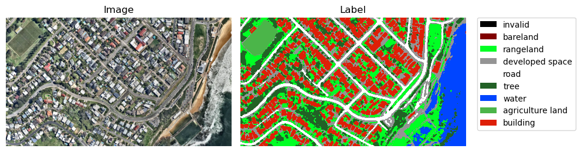
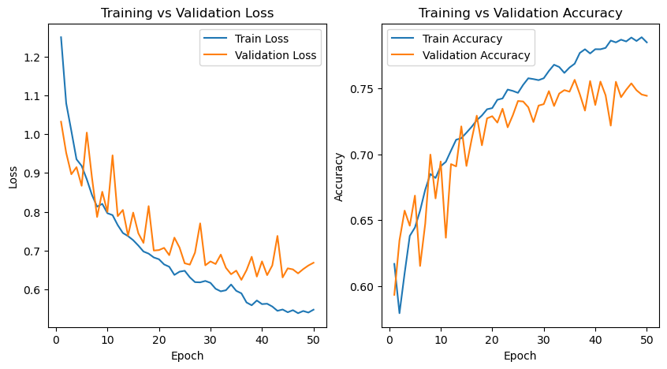

# Aerial Photo Land Cover Segmentation

Drones are widely used in fields like agriculture, construction, geographic research and etc. To analyze a bird's eye view photo taken from a drone, one task is to classify the land cover (such as buildings, vegetation, waters and soil) within it. The photos after classification can be used in further analysis.

This project trains <a href="https://smp.readthedocs.io/en/v0.1.3/models.html#id8">DeepLabV3+</a> (a robust segmentation model) in PyTorch with an open-source labelled dataset <a href="https://open-earth-map.org/">OpenEarthMap</a>. A trained model labels the type of land cover for each pixel as a separate image, or combines within the original photos. 

<p>
  <br>
  <em>
    The model processes the left aerial/satellite photo
    (<a href="https://www.nearmap.com/au/blog/aerial-maps-versus-satellite-maps#image-container-undefined">source</a>)
    to a right label prediction
  </em>
</p>
                    
Besides the image processing, we managed to demonstrate video processing and wrap into webapp. 

## Install Packages
```
$ pip install -r requirement.txt
```

## Pretrained Model
If you want to test a pretrained model directly, execute the following codes and jump directly to <a href="#image-prediction">Image Prediction</a> section.

```
$ pip install huggingface-hub
$ python checkpoints/pretrained_model.py
```

You may also manually download the <a href="https://huggingface.co/Chenfeng-Li/aerial-photo-segmentation/resolve/main/best.pt?download=true">best.pt</a> and move it to the <code>checkpoints</code> file.

### License note

The source code of the repository is under **MIT license**. However, the pretrained model is trained on full OpenEarthMap dataset, where part of data is licensed under **CC BY-NC-SA 4.0**. Therefore, the pretrained model is **not covered by the MIT license** and is intended for **non-commercial use**.

For license details or commercial usage, please review the <a href="https://open-earth-map.org/attribution.html">OpenEarthMap licenses</a> and train a model using only data that explicitly allows commercial use.  


## Download OpenEarthMap Dataset
You may review the dataset information in <a href="https://open-earth-map.org/overview.html">this website</a>, and download using this command.

```
$ python openearthmap_download.py
```

If the script crashes, it is likely because of the network setting of the website. Please manually download <a href="https://zenodo.org/records/7223446/files/OpenEarthMap.zip?download=1">OpenEarthMap.zip</a>, unzip it and move <code>OpenEarthMap_wo_xBD</code> folder in the project directory. 

## Analyze the Dataset

## Train the Model

```
$ python train.py [--epochs=<int>] [--save_every_ckpt]
```

where user may modify

<ul>
    <li><code>--epochs</code>: Number of training epochs, 10 by default.</li>
    <li><code>--save_every_ckpt</code>: without this argument, only the checkpoints of the best model (minimize validation loss) and last model are saved; if include this argument, the checkpoints of best model, last model and every model after each epoch are saved.</li>
</ul>

The model checkpoints will be saved in a <code>checkpoints</code> folder in current directory.

The training and validation loss on the first 50 epochs are as follows. According to the plot, the model performance becomes stable at around 30th epoch.




## Image Prediction

Display the label prediction of an input image and optionally save the figure.
```
$ python image_prediction.py [--image=<str>] [--combine] [--smooth] [--save=<str>] [--model=<str>] 
```
where user may modify
<ul>
    <li><code>--image</code>: The path of an input image. If the path is invalid, nothing will be generated.</li>
    <li><code>--combine</code>: without this argument, only the label prediction are displayed; if include this argument, the figure with transparent predicted label covering above the original image is displayed.</li>
    <li><code>--smooth</code>: without this argument, the raw predicted label from the model will be displayed; if include this argument, the salt-and-pepper noise (i.e. a class with tiny areas surrounded by other classes with large area) is removed and the predicted label is smoother. This may slightly decrease the prediction accuracy and takes more processing time, but the result is more explainable.</li>
    <li><code>--save</code>: The path to save the displayed figure. If leave empty, no figure will be saved.</li>
    <li><code>--model</code>: The path of model checkpoints to be loaded. The default model is the best model saved in <code>checkpoints</code> folder.</li>
</ul>

#### Example
Here we demostrate the performance of a trained model using the following example.

We have an aerial photo (<a href="https://botlink.com/blog/2018/2/9/10-amazing-drone-photos-you-need-to-see#block-yui_3_17_2_1_1528170595778_239755">source</a>) as follows.


If we want to display the only the labe prediction only using the best model, we may execute

```
$ python image_prediction.py --image=assets/photo.png --save=assets/label.png
```

The following plots will be displayed and saved:


To have the predicted label cover the original photo, we may execute

```
$ python image_prediction.py --image=assets/photo.png --combine --save=assets/combined.png
```

The following plots will be displayed and saved:


### Video Prediction
A small step beyond in image prediction. The model processes the video frame by frame and generates a video with label only or label cover on original video.
```
$ python video_prediction.py [--video=<str>] [--combine] [--smooth] [--save=<str>] [--model=<str>]
```

### Webapp Deployment
Deploy a webapp for the model. Not directly related to the project. Details can be found in <a href="https://github.com/Chenfeng-Li/Aerial-Photo-Land-Cover-Segmentation/tree/main/webapp">webapp</a> folder.


